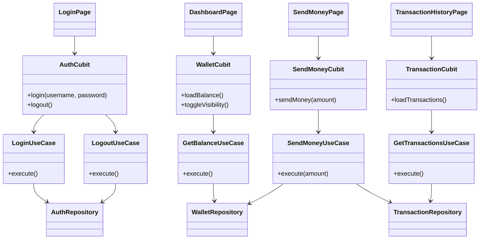

```mermaid
classDiagram
    direction TB

    %% ===== Presentation =====
    class LoginPage
    class DashboardPage
    class SendMoneyPage
    class TransactionHistoryPage

    %% ===== Cubits =====
    class AuthCubit {
        +login(username, password)
        +logout()
    }

    class WalletCubit {
        +loadBalance()
        +toggleVisibility()
    }

    class SendMoneyCubit {
        +sendMoney(amount)
    }

    class TransactionCubit {
        +loadTransactions()
    }

    %% ===== Use Cases =====
    class LoginUseCase {
        +execute()
    }

    class LogoutUseCase {
        +execute()
    }

    class GetBalanceUseCase {
        +execute()
    }

    class SendMoneyUseCase {
        +execute(amount)
    }

    class GetTransactionsUseCase {
        +execute()
    }

    %% ===== Repositories =====
    class AuthRepository
    class WalletRepository
    class TransactionRepository

    %% ===== Relationships =====
    LoginPage --> AuthCubit
    DashboardPage --> WalletCubit
    SendMoneyPage --> SendMoneyCubit
    TransactionHistoryPage --> TransactionCubit

    AuthCubit --> LoginUseCase
    AuthCubit --> LogoutUseCase

    WalletCubit --> GetBalanceUseCase
    SendMoneyCubit --> SendMoneyUseCase
    TransactionCubit --> GetTransactionsUseCase

    LoginUseCase --> AuthRepository
    LogoutUseCase --> AuthRepository
    GetBalanceUseCase --> WalletRepository
    SendMoneyUseCase --> WalletRepository
    SendMoneyUseCase --> TransactionRepository
    GetTransactionsUseCase --> TransactionRepository

```
