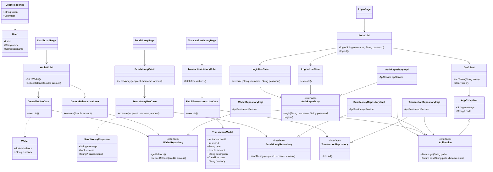

```mermaid
classDiagram
    direction TB

    %% ===== Models =====
    class User {
        +int id
        +String name
        +String username
    }

    class LoginResponse {
        +String token
        +User user
    }

    class Wallet {
        +double balance
        +String currency
    }

    class SendMoneyResponse {
        +String message
        +bool success
        +String? transactionId
    }

    class TransactionModel {
        +int transactionId
        +int userId
        +String type
        +double amount
        +String description
        +DateTime date
        +String currency
    }

    %% ===== Network Layer =====
    class ApiService {
        <<interface>>
        +Future get(String path)
        +Future post(String path, dynamic data)
    }

    class DioClient {
        +setToken(String token)
        +clearToken()
    }

    class AppException {
        +String message
        +String? code
    }

    %% ===== Presentation Layer - Pages =====
    class LoginPage
    class DashboardPage
    class SendMoneyPage
    class TransactionHistoryPage

    %% ===== Presentation Layer - Cubits =====
    class AuthCubit {
        +login(String username, String password)
        +logout()
    }

    class WalletCubit {
        +fetchWallet()
        +deductBalance(double amount)
    }

    class SendMoneyCubit {
        +sendMoney(recipientUsername, amount)
    }

    class TransactionHistoryCubit {
        +fetchTransactions()
    }

    %% ===== Use Cases Layer =====
    class LoginUseCase {
        +execute(String username, String password)
    }

    class LogoutUseCase {
        +execute()
    }

    class GetWalletUseCase {
        +execute()
    }

    class DeductBalanceUseCase {
        +execute(double amount)
    }

    class SendMoneyUseCase {
        +execute(recipientUsername, amount)
    }

    class FetchTransactionsUseCase {
        +execute()
    }

    %% ===== Repository Layer =====
    class AuthRepository {
        <<interface>>
        +login(String username, String password)
        +logout()
    }

    class AuthRepositoryImpl {
        -ApiService apiService
    }

    class WalletRepository {
        <<interface>>
        +getBalance()
        +deductBalance(double amount)
    }

    class WalletRepositoryImpl {
        -ApiService apiService
    }

    class SendMoneyRepository {
        <<interface>>
        +sendMoney(recipientUsername, amount)
    }

    class SendMoneyRepositoryImpl {
        -ApiService apiService
    }

    class TransactionRepository {
        <<interface>>
        +fetchAll()
    }

    class TransactionRepositoryImpl {
        -ApiService apiService
    }

    %% ===== Relationships =====
    %% Pages to Cubits
    LoginPage --> AuthCubit
    DashboardPage --> WalletCubit
    SendMoneyPage --> SendMoneyCubit
    TransactionHistoryPage --> TransactionHistoryCubit

    %% Cubits to UseCases
    AuthCubit --> LoginUseCase
    AuthCubit --> LogoutUseCase
    AuthCubit --> DioClient

    WalletCubit --> GetWalletUseCase
    WalletCubit --> DeductBalanceUseCase

    SendMoneyCubit --> SendMoneyUseCase

    TransactionHistoryCubit --> FetchTransactionsUseCase

    %% UseCases to Repositories
    LoginUseCase --> AuthRepository
    LogoutUseCase --> AuthRepository

    GetWalletUseCase --> WalletRepository
    DeductBalanceUseCase --> WalletRepository

    SendMoneyUseCase --> SendMoneyRepository

    FetchTransactionsUseCase --> TransactionRepository

    %% Repositories to ApiService
    AuthRepositoryImpl --|> AuthRepository
    AuthRepositoryImpl --> ApiService

    WalletRepositoryImpl --|> WalletRepository
    WalletRepositoryImpl --> ApiService

    SendMoneyRepositoryImpl --|> SendMoneyRepository
    SendMoneyRepositoryImpl --> ApiService

    TransactionRepositoryImpl --|> TransactionRepository
    TransactionRepositoryImpl --> ApiService

    %% Models relationships
    LoginResponse --> User
    SendMoneyUseCase ..> SendMoneyResponse
    FetchTransactionsUseCase ..> TransactionModel
    GetWalletUseCase ..> Wallet

    %% Exception handling
    AppException <|-- ApiService
    DioClient --> AppException

```
