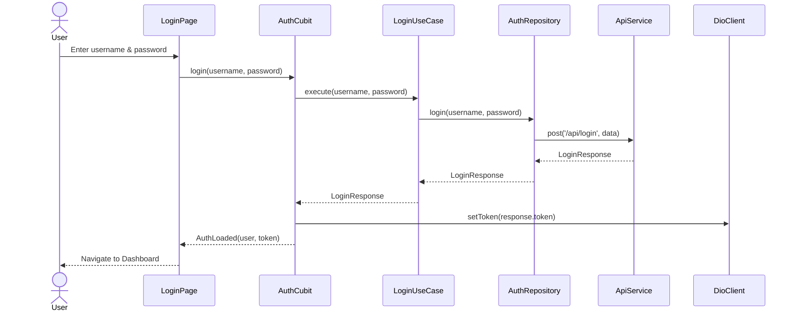

```mermaid
sequenceDiagram
    actor User
    participant LoginPage
    participant AuthCubit
    participant LoginUseCase
    participant AuthRepository
    participant ApiService
    participant DioClient

    User ->> LoginPage: Enter username & password
    LoginPage ->> AuthCubit: login(username, password)
    AuthCubit ->> LoginUseCase: execute(username, password)
    LoginUseCase ->> AuthRepository: login(username, password)
    AuthRepository ->> ApiService: post('/api/login', data)
    ApiService -->> AuthRepository: LoginResponse
    AuthRepository -->> LoginUseCase: LoginResponse
    LoginUseCase -->> AuthCubit: LoginResponse
    AuthCubit ->> DioClient: setToken(response.token)
    AuthCubit -->> LoginPage: AuthLoaded(user, token)
    LoginPage -->> User: Navigate to Dashboard

```