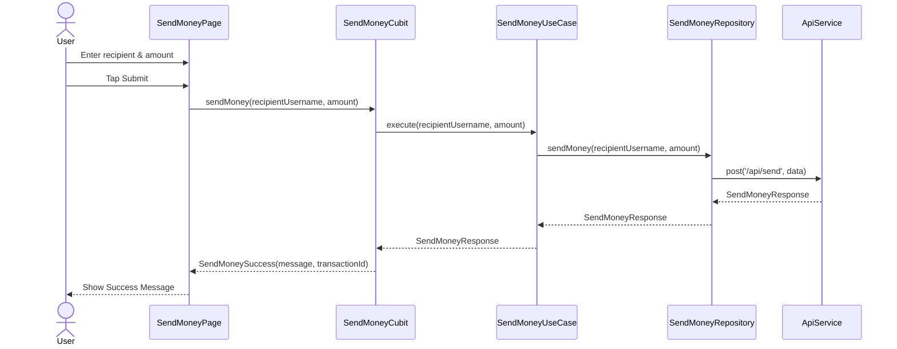

```mermaid
sequenceDiagram
    actor User
    participant SendMoneyPage
    participant SendMoneyCubit
    participant SendMoneyUseCase
    participant SendMoneyRepository
    participant ApiService

    User ->> SendMoneyPage: Enter recipient & amount
    User ->> SendMoneyPage: Tap Submit
    SendMoneyPage ->> SendMoneyCubit: sendMoney(recipientUsername, amount)
    SendMoneyCubit ->> SendMoneyUseCase: execute(recipientUsername, amount)

    SendMoneyUseCase ->> SendMoneyRepository: sendMoney(recipientUsername, amount)
    SendMoneyRepository ->> ApiService: post('/api/send', data)
    ApiService -->> SendMoneyRepository: SendMoneyResponse
    SendMoneyRepository -->> SendMoneyUseCase: SendMoneyResponse

    SendMoneyUseCase -->> SendMoneyCubit: SendMoneyResponse
    SendMoneyCubit -->> SendMoneyPage: SendMoneySuccess(message, transactionId)
    SendMoneyPage -->> User: Show Success Message
    
```