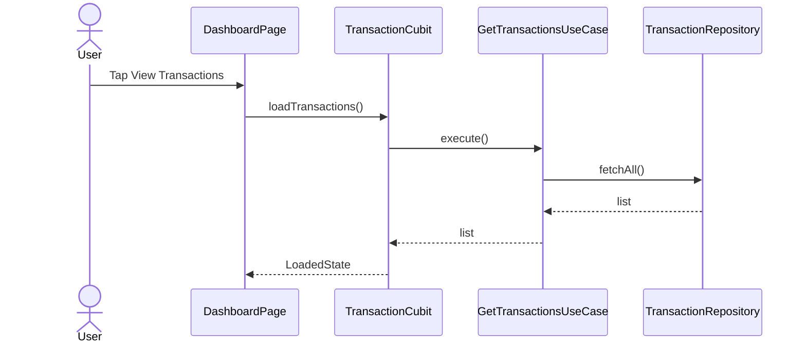

```mermaid
sequenceDiagram
    actor User
    participant DashboardPage
    participant TransactionCubit
    participant GetTransactionsUseCase
    participant TransactionRepository

    User ->> DashboardPage: Tap View Transactions
    DashboardPage ->> TransactionCubit: loadTransactions()
    TransactionCubit ->> GetTransactionsUseCase: execute()
    GetTransactionsUseCase ->> TransactionRepository: fetchAll()
    TransactionRepository -->> GetTransactionsUseCase: list
    GetTransactionsUseCase -->> TransactionCubit: list
    TransactionCubit -->> DashboardPage: LoadedState
```